Here you go C — **your complete Summary**, updated with the new **Success Modal architecture, responsibilities, and on-chain fetch logic**, fully integrated into the document in a clean, structured, production-ready Markdown format.

This is the **final official Summary** that should go into your repo as:

`docs/ARCHITECTURE.md`
or
`docs/MINIAPP_SUMMARY.md`

Everything important, including the modal upgrade, is now included.

---

# 🟦 **Hybrid Web + Farcaster MiniApp — Full Technical Summary (Updated)**

This document summarizes your entire architecture:

* x402 Mint Flow
* Farcaster MiniApp global context
* Modal-heavy risks
* Final Success Modal architecture
* Error analysis & prevention
* Safe hybrid rendering

Everything here is production-safe.

---

# #️⃣ **1. Correct x402 Minting Flow (Final Version)**

Your minting flow must follow this exact sequence:

```mermaid
flowchart TD

    A[User clicks Mint] --> B[verify() — EIP-712 Signature]
    B -->|x402 Header| C[/api/x402/verify<br/>Status: verified/]
    C --> D[settle() — On-chain Payment]
    D -->|Funds Leave Wallet| E[/api/x402/settle<br/>Status: settled/]
    E --> F[mint() — Smart Contract Mint]
    F -->|tokenId, txHash| G[/api/x402/update-mint-status<br/>Status: minted/]
    G --> H[Success Modal]
```

### ✔ `verify()`

* Signature only
* No funds move
* No gas
* Safe

### ✔ `settle()`

**Funds leave wallet here.**
This is the real payment transaction.

### ✔ `mint()`

Only after payment success.

### ✔ `updateMintStatus()`

Final tracking for audit + recovery.

---

# #️⃣ **2. Application Error (Farcaster MiniApp Crash)**

Warpcast MiniApp WebView cannot show console logs.
Any uncaught React exception shows:

> **Application error: a client-side exception has occurred**

### Root cause in your app before refactor:

The Success Modal accessed:

```
farcasterContext.fid
```

But context wasn't ready, so:

```
undefined.fid → crash → Warpcast error
```

This happened because:

* The MiniApp provider was fragmented
* The context was not persistent
* Modal rendered too quickly (modal-heavy app)
* No global ready guard

---

# #️⃣ **3. What “Modal-Heavy” Means and Why It’s Dangerous**

Your UI stack is **modal-heavy**, meaning many key actions happen inside modals:

* Payment steps (verify, settle)
* Minting
* Success
* Sharing
* Error recovery

Modals render:

* **Fast**
* **Before context is ready**
* **Before hydration stabilizes**
* **Independently of parent screens**

This makes MiniApps fragile unless:

### ✔ Farcaster context is global

✔ Context is persistent across modals
✔ Context is hydration-safe (`isReady`)
✔ Modals do **not** depend on context to render NFT
✔ On-chain data is used as primary source
✔ Farcaster context is **optional**, not required

---

# #️⃣ **4. Full Farcaster MiniApp Context (Based on Official SDK)**

Your global provider (`FarcasterMiniAppProvider`) now exposes:

### **User Context**

* fid
* username
* displayName
* pfpUrl
* location

### **Location Context**

* cast_embed
* cast_share
* notification
* launcher
* channel
* open_miniapp / cross-miniapp referrer

### **Client Context**

* platformType (web/mobile)
* clientFid
* safeAreaInsets (critical for mobile layout)
* notificationDetails

### **Features Context**

* haptics
* camera/mic availability

### **Helper Actions**

* `composeCast()`
* `openUrl()`
* (future) `haptics()`

### **State Flags**

* `isFarcaster`
* `isReady`
* Provider loads once and persists across pages & modals

---

# #️⃣ **5. Updated Architecture Diagram (Final)**

```mermaid
flowchart TD

    subgraph Global Context
        FC[FarcasterMiniAppProvider
            - sdk.isInMiniApp()
            - sdk.context
            - user / location / client / features
            - safeAreaInsets
            - composeCast(), openUrl()
            - isReady, isFarcaster
            - sdk.ready()
            - persistent state
        ]
    end

    subgraph Router
        PG[Page.tsx<br/>MiniApp vs Web Switch]
    end

    subgraph MiniApp Mode
        MAP[MiniAppClientProviders]
        MAS[MiniAppScreen]
    end

    subgraph Web Mode
        WP[Providers]
        WS[WebScreen]
    end

    subgraph Shared
        HC[HomeContent]
        CM[CustomMint]
        SM[SuccessModal — reads chain]
    end

    FC --> PG
    PG -->|MiniApp| MAP
    PG -->|Web| WP

    MAP --> MAS
    WP --> WS

    MAS --> HC
    WS --> HC
    HC --> CM
    CM --> SM
```

---

# #️⃣ **6. Final Success Modal Architecture (Updated)**

### ✔ Success Modal MUST read NFT **from the blockchain**, NOT from props.

This makes the modal:

* Trustless
* Crash-proof
* MiniApp-safe
* Independent of any parent state
* Independent of Farcaster context readiness

### ✔ Success Modal rendering rules:

| Feature                     | Source                    | Required?    |
| --------------------------- | ------------------------- | ------------ |
| NFT preview (animation_url) | **Blockchain (tokenURI)** | **Required** |
| tokenId, txHash             | Props                     | Required     |
| phrase data (html)          | Blockchain                | Required     |
| Farcaster share buttons     | Global context            | Optional     |
| Farcaster `fid`, `username` | Context                   | Optional     |
| Safe-area insets            | Context                   | Optional     |

---

# #️⃣ **7. Why On-chain Fetch Fixes Everything**

Success Modal now:

* Performs a `useReadContract()`
* Decodes `tokenURI` safely
* Extracts `animation_url`
* Renders NFT independently

This prevents:

* Missing animationUrl
* Parent state timing issues
* MiniApp rehydration crashes
* Warpcast “application error” screen

---

# #️⃣ **8. Updated Success Modal Flow Diagram**

```mermaid
flowchart TD

    A[Mint Success] --> B[SuccessModal Opens]
    B --> C[Fetch tokenURI from blockchain]
    C --> D[Decode JSON → animation_url]
    D --> E[Render NFT iframe]
    
    E --> F{fc.isFarcaster & fc.isReady?}
    F -->|Yes| G[Enable share to Farcaster]
    F -->|No| H[Hide or disable share button]
```



**Key point:**
NFT display does *not* depend on Farcaster context.
Only sharing does.

---

# #️⃣ **9. Effects of the Fix**

### ✔ No more crashes inside Warpcast

### ✔ NFT always displays correctly

### ✔ Farcaster context is optional, not required

### ✔ Mint success experience is identical on Web & MiniApp

### ✔ Modals become safe (modal-heavy apps no longer risky)

### ✔ Trustless: modal reflects real on-chain state

### ✔ Perfect hybrid architecture

---

# 🎉 **This is the final, fully updated Summary with all-important information included, including your corrected Success Modal behavior.**

If you want:

👉 **"C, generate the final SuccessModal + Provider code in one file."**
